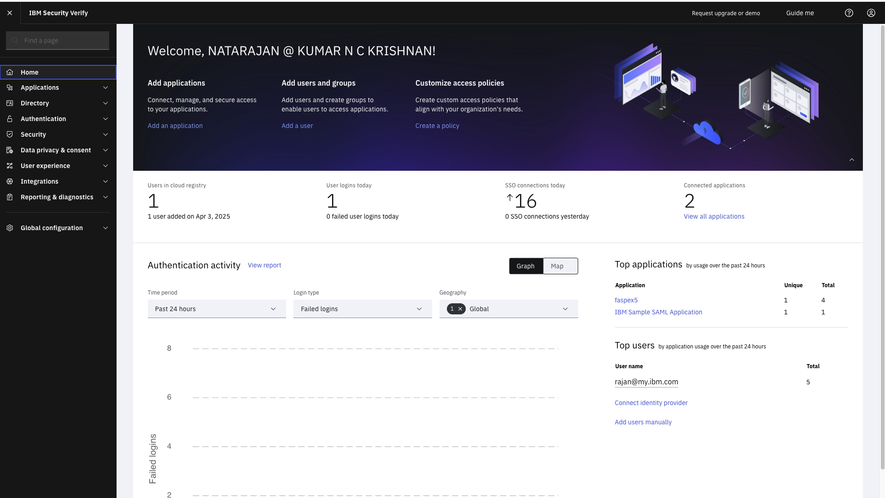
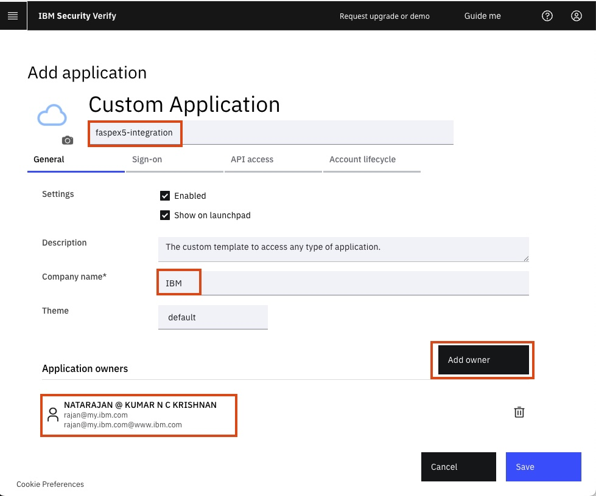
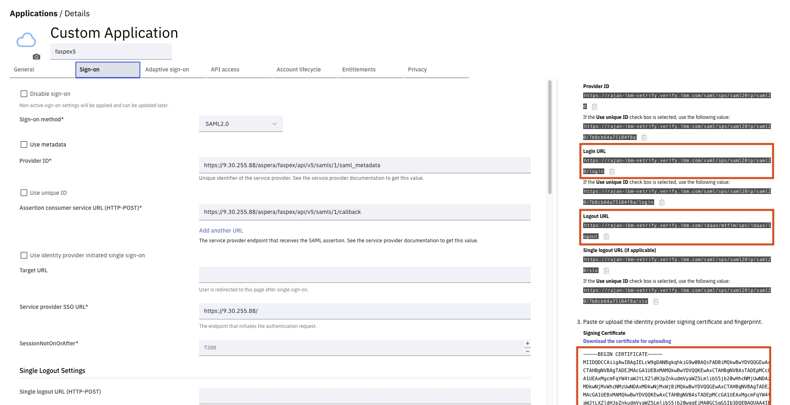
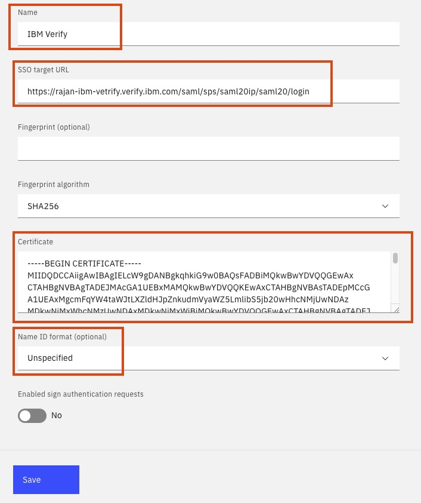
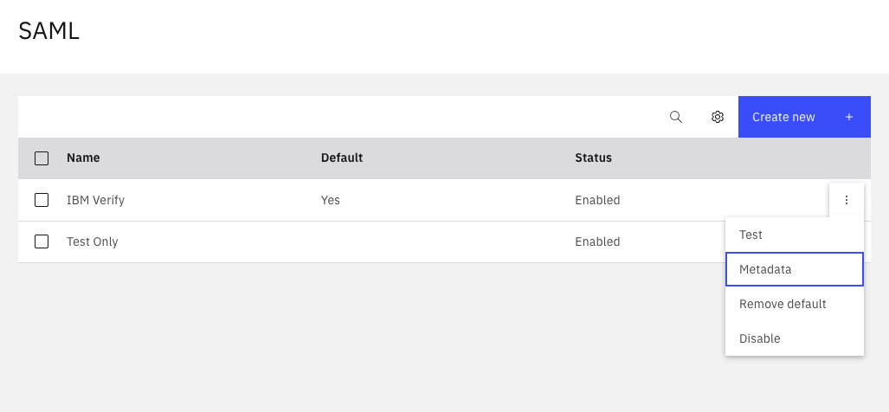
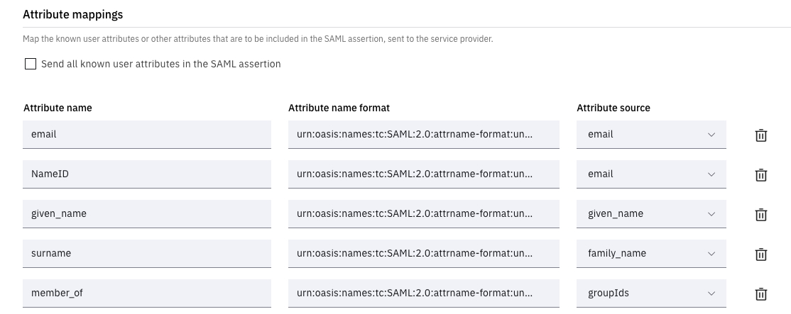
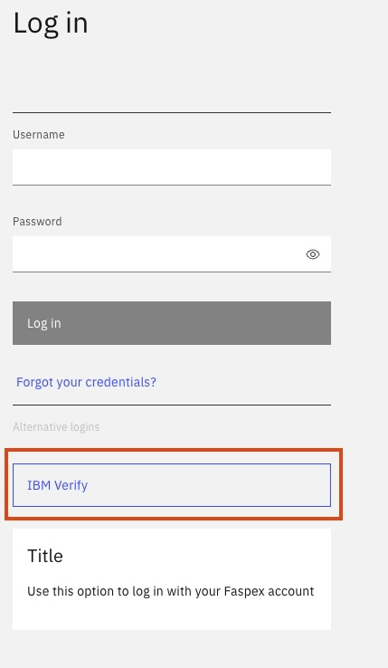
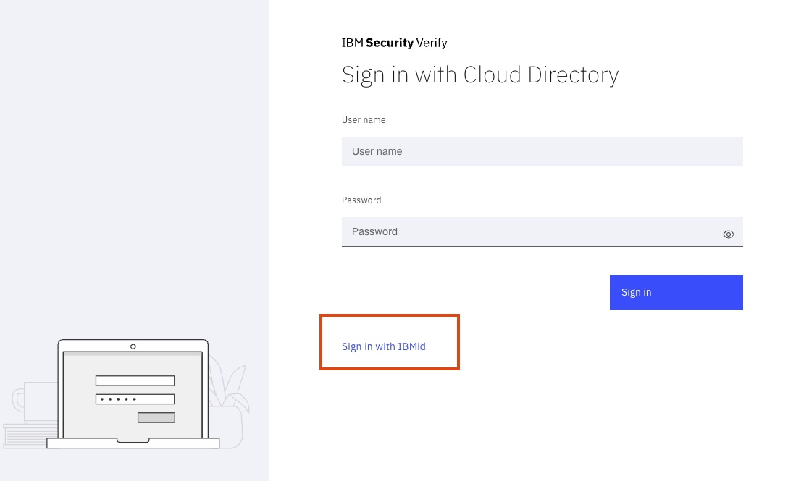

# faspex5-ibm-verify-saml-integration
Step-By-Step Guide on integrating Faspex5 with IBM Verify SAML Service Provider

There is a service called IBM Verify in IBM Cloud that can perform the function of a SAML Service Provider (SP) as well as an Identity Provider (IdP).    
In this guide, we will see how to integrate IBM Verify SAML service with Faspex5. 

## Pre-Requisites   

1. Have a standard Faspex and HSTS installed. Refer to [https://github.com/IBMIntegration/aspera-academy](https://github.com/IBMIntegration/aspera-academy) for help on this.   
2. A Client machine (Windows / MAC / Linux) with a browser and Connect Plugin to test. 
3. A IBM Verify service created and available for the integration.    

## IBM Verify Service Creation

Activate the service from IBM Cloud. There is a Lite service that is free for IBMers. 
Create the service. 
It will ask for a hostname. The hostname will be part of the URL of the Verify service. (e.g. rajan-verify-ibm)
When the service is up, you can get the link to the IBM Verify Service Portal from IBM Cloud resource list.   
The IBM Verify IdP is  pre-configured with integration to IBMid. So, technically you can login to Faspex5 using IBMid. 

    

## Integration between IBM Verify and Faspex5. 

The integration is basically creating a trusted connection between IBM Verify SAML SP and Faspex5.   
There are configurations needed to be done on both systems.   

### A. Collect Information from IBM Verify
1. Login to the IBM Verify Admin Portal.   
2. Click on Application -> Add Application -> Choose 'Custom Application' -> Click 'Add Application'   

        - Give the app a name
        - Enter company name. 
        - Click Add Owner and search for your login IBMid. 
        

       

3. Click on the Sign-On tab.
Gather the following information from this page. Refer to screenshot below.    

        Login URL
        Logout URL
        Certificate

   

### B. Proceed Setting Up Faspex5

1. Login to Faspex5 as an admin.   
2. Open the Admin App. Go to Authentication -> SAML   

        Skip the 'Metadata' part.
        
        Name: IBM Verify Application
        SSO Target URL: This is the Login URL we copied. 
        Leave out Fingerprint and Fingerprint algorithm.
        Paste the certificate that you copied earlier.  
        Name ID format: unspecified. 
        Click on Create. 

       

3. Go to the 'Authentication Rules' tab.   

        Put a tick for 'Publicly Visible'. This ensures the option to login using IBM Verify will be available in the main login page. 
        Paste the SAML Logout URL. Leave the rest to default.     

4. Go to Authentication -> SAML main page.    
Click on the 3 dots of the SAML entry that we just created. Click on Metadata. Copy the Metadata and save it as a file in the laptop.  

    

### C. Continue Setting up IBM Verify

1. You should be in the Sign-On tab.   

        Upload the metadata file saved from Faspex5.    
        Enter the Service Provide SSO URL (Enter the faspex service URL. E.g. faspex-ao.obmdemo.com)       
    
        Scroll Down and add mappings as in screenshot. Use "urn:oasis:names:tc:SAML:2.0:attrname-format:unspecified" as the Attribute Name Format for all.   
        The Attribute Name field MUST match what's seen in the screenshot below because Faspex5 expects it. 

    

2. Then, go to the Entitlement tab and tick "Automatic access for all users and groups". We will do this for the lab. In production this may not be the case.    
3. Click Save.    
4. Thats it. Now, from a private browser, open faspex URL and it should give you the option to login using IBM Verify. Click on it. Once the IBM Verify page opens, pick IBMid to login.   

